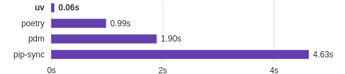

# uvインストール

数年前までは、`Poetry`、`Pipenv`、`pyenv`を組み合わせて使うことが多かったでしょう。
`uv`登場により、１つのツールでこれらを置き換えることができるようになりました。

今後、`uv`の利用がデファクトスタンダードとなっていくでしょう。

## uvとは

公式では下記の表現がされています。

!!! quote "[uv](https://docs.astral.sh/uv/)"

    An extremely fast Python package and project manager, written in Rust.

意訳すると「Rustで実装された超高速なPythonパッケージ＆プロジェクトの管理をするツール」と解釈できます。

実際にPythonで開発を行うときには、下記のような様々な管理が必要となります。

1. **仮想環境の管理**: Pythonの仮想環境を作成し管理
1. **プロジェクト管理**: プロジェクトにおける様々な設定の管理
1. **パッケージ管理**: プロジェクトで利用する外部パッケージ（ライブラリ）の管理
1. **Pythonバージョン管理**: 各プロジェクトごとに必要なPythonバージョンの管理

uvが登場する以前は、様々なツールを組み合わせてこれらを実現する必要があり、ツールのデファクトスタンダードもなかなか固まらず、とても煩雑でした。
uvを用いると、１つのツールでこれら全てを扱うことができ、Python開発における煩わしさを一掃してくれる存在です。
まだ登場して日が浅いですが、急速にPython開発における必須ツールとして成長しています。

!!! info "uv登場以前のツール群"

    **venvモジュール**

    Pythonの標準モジュールです。
    後述する**Poetry**や**PipEnv**を用いない場合、Pythonの仮想環境は自分自身で作成し管理する必要がありました。

    下記は、`.venv`という名前で仮想環境を作成し、有効化する例です。

    ```bash
    python -m venv .venv
    source ./.venv/bin/activate
    ```

    **Poetry**、**PipEnv**

    venvの管理、パッケージの管理、プロジェクトの管理を行うツールです。

    uv登場以前によく比較されて語られていましたが、Poetryの方がユーザ数が多く流行っている印象でした。

    Pythonのバージョン管理を行う機能はないため、後述する**pyenv**と併用されました。

    **pyenv**

    Pythonのバージョン管理を行うツールです。

    Nodeで言うnvm、n、voltaのような存在です。

    **Rye**

    uvの前身と言えるツールです。Rye

??? info "プログラミング言語 Rust"

    システムプログラミング向けのモダンなプログラミング言語で、下記の特徴があります。

    1. **メモリ安全性**
        - C/C++言語においてバグとなりやすいメモリ管理（`malloc`、`free`などで実装する部分）について、*所有権*と*ライフタイム*という概念を用いることでコンパイル時点で安全性を保証します
    1. **実行速度**
        - C/C++言語と肩を並べる実行速度で、プログラミング言語の中でも最速と言えます

    昨今、様々な開発用ツールがRust実装により高速化されることが多く、uvもその流れの1つと言えるでしょう。

!!! tip "どれくらい高速か"

    [公式ページ](https://docs.astral.sh/uv/)に、類似ツールとの速度比較の下記グラフが載っています。

    

    2つめの*Poetry*は*uv*登場以前にデファクトスタンダードとして利用されてきたツールです。
    10〜100倍高速であることがわかります。

## uvインストール

下記のページを参考に、インストールしていきましょう。

[Installation \| uv](https://docs.astral.sh/uv/getting-started/installation/)

### Windows

#### スタンドアローンインストーラ

下記でuvをインストールします。

```powershell
powershell -ExecutionPolicy ByPass -c "irm https://astral.sh/uv/install.ps1 | iex"
```

!!! info

    インターネットから取得したスクリプトを実行するため、PowerShellの実行ポリシーを`ByPass`と指定しています。

#### パッケージマネージャ

Windows上でパッケージマネージャを利用している場合は、下記でもインストールできます。

WinGet:

```powershell
winget install --id=astral-sh.uv  -e
```

Scoop:

```powershell
scoop install main/uv
```

### macOS / Linux

#### Homebrew

下記でuvをインストールします。

```bash
brew install uv
```

#### スタンドアローンインストーラ

```bash
curl -LsSf https://astral.sh/uv/install.sh | sh
```

??? info "その他のインストール方法"

    いずれも、詳細は[公式ページ](https://docs.astral.sh/uv/getting-started/installation/)をご参照ください。

    **Pythonがインストール済みの場合**

    `pipx`、`pip`を用いてインストールできます。

    **Cargoがインストール済みの場合**

    uvはRustで実装されているため、ソースコードから直接ビルドしてインストールできます。

    **Docker**

    公式でDockerイメージが提供されています。

    **実行ファイルを直接ダウンロード**

    GitHubリリースとしてビルド済みバイナリが配置されており、ダウンロードして利用できます。

## スタンドアローンインストーラを用いた場合のuvのアップグレード

パッケージマネージャを使わずにスタンドアローンでインストールした場合、uvのバージョンは自身で管理する必要があります。

uvのバージョンが更新された際に、下記コマンドで手動アップデートを行います。

```bash
uv self update
```
