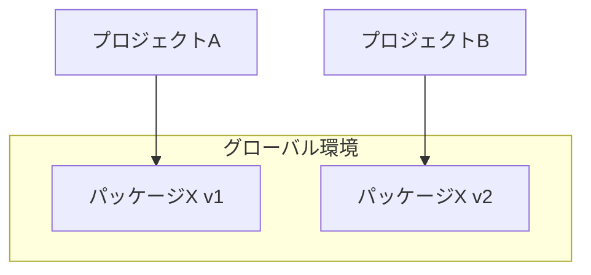
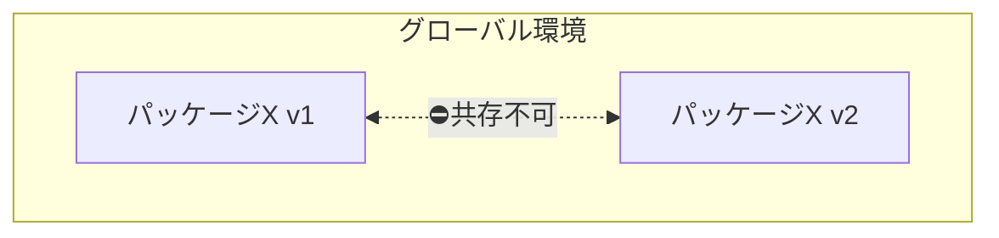
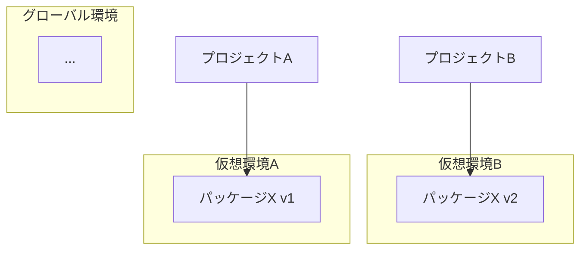

# 仮想環境

Pythonにおける開発に欠かせない、仮想環境(Virtual Environment)(1)について紹介します。
{.annotate}

1. 仮想環境を扱うツールが`venv`という名前なのもあり、略して`venv`と呼称されます。

## 仮想環境の必要性

Pythonではプロジェクトの環境は自動で分離されません。

何も考えずにパッケージをインストールすると、そのパッケージは**グローバルな環境にインストール**されます。
一般的にPythonはシステム上にインストールされているため、システムに対しパッケージがインストールされることになります。

これによる問題点は何でしょうか？

例えば、2つのPythonプロジェクトとして「プロジェクトA」と「プロジェクトB」があるとします。
プロジェクトAではパッケージXの`v1`を使用しており、プロジェクトBではパッケージXの`v2`を使用しているとします。

グローバルな環境にそれぞれがインストールされると、パッケージXの`v1`と`v2`が共存することになります。



しかし残念ながら、あるパッケージの異なるバージョンが共存することはできません。
実際に異なるバージョンをインストールすると、後勝ちとなり先に存在していたバージョンが上書きされます。



これでは他プロジェクトとの**パッケージ競合**を常に気にかける必要があり、非常に煩雑です。
そもそも特定のプロジェクトでしか使わないパッケージを、グローバルな環境にインストールする事自体が望ましくありません。

## 仮想環境による環境の分離

仮想環境がこの問題を解決します。

仮想環境はプロジェクトごとに作成します。
パッケージは仮想環境に対しインストールされるため、他の環境からは分離して管理されます。
各仮想環境はそれぞれ独立しているため、他の環境を気にかける必要がありません。



## 仮想環境の扱い方

では、実際に仮想環境の使い方を見てみましょう。

ここでは、Ubuntu上での動作を例にします。
システムにPythonがインストールされていれば、同様に動作するでしょう。

```bash
mkdir venv_demo
```

```bash
cd venv_demo
```

仮想環境は、`venv`モジュールを利用します。
Ubuntu24.04では、`apt`コマンドでモジュールをインストールします。

```bash
sudo apt install python3-venv
```

`venv`モジュールを使用し、`.venv`という名前で仮想環境を作成します。

```bash
python -m venv .venv
```

!!! コマンドの意味

    `-m venv`で、`venv`モジュールをスクリプトとして呼び出しています。

!!! tip "仮想環境の名前"

    仮想環境の名前は任意に指定できますが、慣例として`.venv`という名前が使用されます。

    VSCodeなどのIDEもこの名前で仮想環境を検知しているため、特別な理由がない限り`.venv`としておきましょう。

コマンド実行すると、指定した仮想環境名でディレクトリが作成されます。
ディレクトリ内は下記のような構造となっているはずです。

```bash

```

仮想環境を作成した後、この仮想環境を有効化する必要があります。
